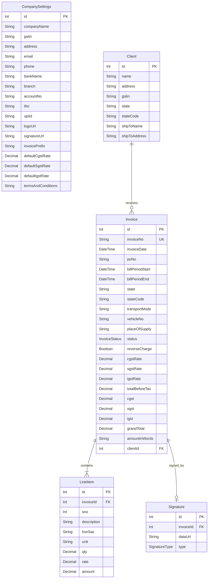

# RKE GST Invoice Generator — Project Architecture

Welcome to the **RKE GST Invoice Generator** codebase, a premium, offline-first application designed for **M/S Radha Kishan Enterprises** (a heavy engineering equipment rental business). This application is bootstrapped using **Next.js 16 (App Router)** and **React 19**, incorporating modern web design best practices (sleek layouts, system dark/light modes, premium typography, and dynamic micro-interactions).

---

## 🛠️ Technology Stack & Architecture

The application is built on a modern, robust, and highly-performant stack:

- **Core Framework**: [Next.js 16](https://nextjs.org) (App Router, Server Actions, Dynamic Streaming) and [React 19](https://react.dev).
- **Styling**: [Tailwind CSS v4](https://tailwindcss.com/) with Vanilla CSS custom tokens, providing modern transitions and responsive design.
- **Database ORM**: [Prisma ORM v6](https://www.prisma.io/) with a lightweight, high-performance [SQLite](https://www.sqlite.org/) local database.
- **State Management**: [Zustand](https://github.com/pmndrs/zustand) for fast, reactive client-side store management inside the invoice builder.
- **Form & Payload Validation**: [Zod](https://zod.dev) schemas enforcing rigorous validation for data safety across API and DB boundaries.
- **Integrations**:
  - `@react-pdf/renderer` for elegant, dynamic, print-ready PDF invoice generation.
  - `react-signature-canvas` for an interactive, responsive HTML5 signature pad.
  - `qrcode.react` & custom UPI deep-links for generating scannable QR codes for seamless client payments.
  - `xlsx` & `jszip` for exporting and batch-processing invoice sheets.

---

## 📂 Project Directory Structure

Here is a comprehensive map of the project's folder layout:

```text
rke-invoice/
├── app/                        # Next.js App Router (Pages, Layouts, Server Actions)
│   ├── actions/                # Next.js Server Actions (Database Mutations)
│   │   ├── invoices.ts         # Actions for creating, updating, and deleting invoices
│   │   └── settings.ts         # Actions for updating company settings
│   ├── dashboard/              # Invoices list, summary cards, and analytics
│   │   └── page.tsx
│   ├── invoices/               # Invoice editor and creator routes
│   │   ├── [id]/               # Single invoice detail view & edit wrapper
│   │   │   └── page.tsx
│   │   └── new/                # New invoice creation page
│   │       └── page.tsx
│   ├── settings/               # System and Company Configuration page
│   │   └── page.tsx
│   ├── globals.css             # Tailwind CSS imports & custom variables
│   ├── layout.tsx              # Root HTML wrapper with theme providers and Toasters
│   └── page.tsx                # Redirects directly to /dashboard
├── components/                 # Component Library (Separated by domain)
│   ├── dashboard/              # Dashboard-specific interactive tables and summaries
│   ├── export/                 # Spreadsheet export actions (XLSX)
│   ├── invoice/                # Invoice builder form, live preview, and stores
│   │   ├── InvoiceEditor.tsx   # Wrapper coordinating Form & Live Preview side-by-side
│   │   ├── InvoiceForm.tsx     # Rich, dense form for invoice meta, client details & line items
│   │   ├── InvoicePreview.tsx  # High-fidelity live view replicating print-style GST tax invoices
│   │   ├── types.ts            # Type definitions for the client-side state
│   │   └── useInvoiceStore.ts  # Zustand store for real-time form updates & sync
│   ├── layout/                 # Shell, navigation, sidebar, and theme toggle buttons
│   ├── pdf/                    # Server-side & client-side printable PDF templates
│   ├── qr/                     # Dynamic UPI QR code generator component
│   ├── settings/               # Company settings and defaults modification form
│   ├── signature/              # Interactive drawn signature pad dialog
│   └── ui/                     # Premium prebuilt shadcn-inspired interface primitives
├── lib/                        # Shared utilities and helper modules
│   ├── bootstrap.ts            # Database bootstrapping, seed data, and invoice number sequencing
│   ├── calculations.ts         # GST Tax computation rules and Indian Number-to-Words converter
│   ├── db.ts                   # Cached global PrismaClient instantiation
│   ├── defaults.ts             # Default parameters (e.g. M/S Radha Kishan Enterprises metadata)
│   ├── export.ts               # Excel/ZIP sheet creators
│   ├── qr.ts                   # UPI QR code helpers
│   └── utils.ts                # Dynamic tailwind-merge helper (cn)
├── prisma/                     # Database schemas and migrations
│   ├── dev.db                  # Local SQLite database
│   └── schema.prisma           # Prisma Database schemas and relationships
├── public/                     # Static assets (logos, fallback signatures, icons)
├── package.json                # Project dependencies and script runner configurations
└── tsconfig.json               # TypeScript path mapping and type configurations
```

---

## 🗄️ Database Schema & Models

The SQLite database schema is configured in [schema.prisma](file:///e:/RKE%20software/rke-invoice/prisma/schema.prisma) with five highly integrated tables:



### Key Schema Characteristics:
1. **`Invoice`**: Tracks GST details (rates/amounts for CGST, SGST, IGST), reverse charge applicability, transportation/vehicle metadata, PO details, and billing periods.
2. **`Client`**: Implements separation between *Billed-To* (corporate entity address) and *Shipped-To* (physical plant/site address, crucial for logistics operations).
3. **`LineItem`**: Leverages a composite unique index `@@unique([invoiceId, sno])` ensuring serial number ordering remains consistent and non-conflicting within an invoice.
4. **`CompanySettings`**: Houses all primary metadata for Radha Kishan Enterprises, including default GST rates, banking/UPI details, corporate address, and terms.
5. **`Signature`**: One-to-one relationship with `Invoice`, capturing drawn, uploaded, or typed signature assets.

---

## 🧮 Core Business Logic & Algorithms

### 1. GST Tax Mode Selection (`lib/calculations.ts`)
The application automatically determines tax structures using the **State Codes** of the supplier (RKE) and client:
- **Intra-State (CGST + SGST)**: Applied if both state codes match (e.g., Uttar Pradesh to Uttar Pradesh, code `09`). Tax is divided equally (e.g. 9% CGST + 9% SGST).
- **Inter-State (IGST)**: Applied if the client state code is different (e.g., Uttar Pradesh to Maharashtra, code `27`). An aggregate rate (e.g. 18% IGST) is applied directly.

### 2. Auto-Sequenced Invoice Numbers (`lib/bootstrap.ts`)
When creating a new invoice, the system scans existing invoices matching the company's active prefix (e.g. `RKE-2026-`). It parses the suffixes, identifies the current highest numeric value, increments it, and pads it to ensure a clean sequential identifier (e.g. `RKE-2026-001`, `RKE-2026-002`).

### 3. Indian Number-to-Words Converter (`lib/calculations.ts`)
To meet strict statutory requirements, the converter formats numbers according to the **Indian Numbering System** (Lakhs and Crores rather than Millions/Billions):
- **Example**: `1,25,500.50` yields:
  > *"Rupees One Lakh Twenty Five Thousand Five Hundred and Paise Fifty Only"*

### 4. Dynamic UPI Payments (`lib/calculations.ts` & `components/qr/`)
A custom UPI deep-link URI is constructed dynamically:
`upi://pay?pa={UPI_ID}&pn={COMPANY_NAME}&am={GRAND_TOTAL}&cu=INR&tn=Invoice%20{INVOICE_NO}`
This URI is rendered as a clean, responsive QR code in the invoice preview, enabling clients to scan and instantly settle outstanding amounts.

---

## 🎨 User Interface & Page Flows

1. **Dashboard (`/dashboard`)**:
   - **Metrics Panel**: Displays dynamic metrics for *Total Invoiced*, *Total Paid*, and *Pending Balance* specifically filtered for the current month.
   - **Recent Invoices Table**: Fully searchable and filterable table displaying clients, dates, statuses (`DRAFT`, `SENT`, `PAID`), and actions.

2. **Invoice Editor (`/invoices/new` and `/invoices/[id]`)**:
   - Implements a modern **Side-by-Side Split View** on large screens:
     - **Left Pane (Form)**: High-density inputs split into logical groups (Invoice Details, Consignee Info, Line Items, Signature Panel). Uses a robust Zustand store (`useInvoiceStore.ts`) to immediately capture every keystroke.
     - **Right Pane (Live Preview)**: Replicates the absolute look-and-feel of a physical, print-perfect tax invoice page in real-time, responding instantly to form adjustments.
   - **Actions Drawer**: Provides secondary controls for generating print/PDF views, exporting spreadsheet schedules (XLSX), downloading zip packets, and status triggers.

3. **Settings (`/settings`)**:
   - Enables users to override corporate profile parameters (bank details, GSTIN, default tax rates, and legal terms) which immediately update subsequent invoice defaults.

---

## 💡 Developer Guidelines & Development Workflows

- **Local Running**:
  - Standard server launch: `npm run dev` (starts development environment on [http://localhost:3000](http://localhost:3000)).
- **Database Migrations**:
  - Use Prisma to sync scheme adjustments: `npx prisma db push` or `npx prisma migrate dev`.
- **Aesthetics & Styling**:
  - Always prefer the established theme configuration. Dark and Light modes should maintain premium readability with high contrast ratios, using harmonized HSL color palettes and smooth dynamic micro-animations.
