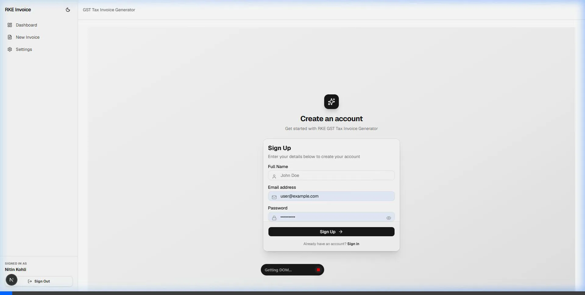
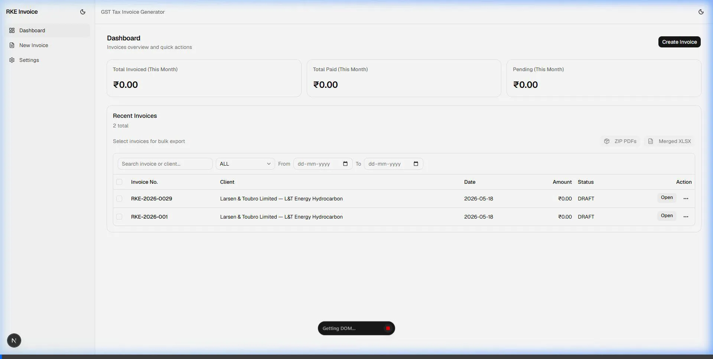
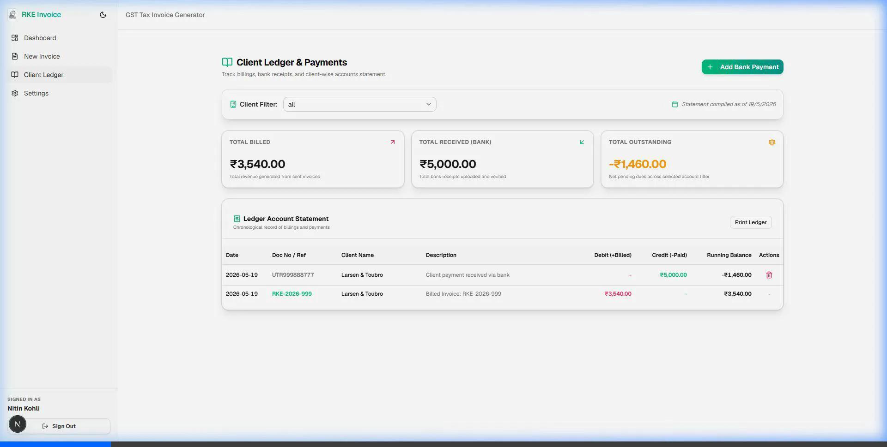
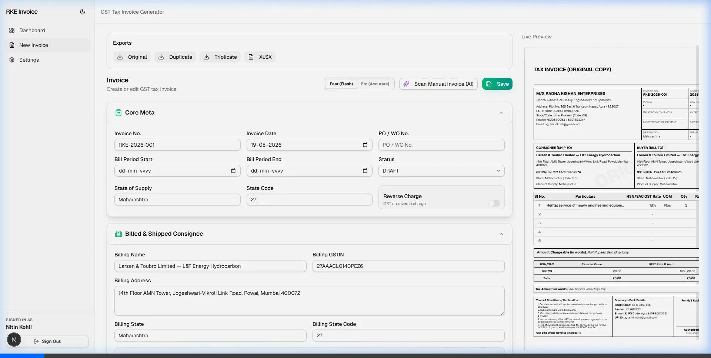

# 🧾 RKE Invoice & Ledger Manager

<p align="center">
  
</p>

<p align="center">
  <strong>A Premium GST Tax Invoice Generator & Client Ledger Account Statement Manager</strong>
</p>

<p align="center">
  
  
  
  
  
  
</p>

---

## 📖 Overview

**RKE Invoice & Ledger Manager** is a premium, modern, and highly interactive business management suite custom-tailored for **RKE (Rental Service of Heavy Engineering Equipments)**. It streamlines client invoicing, ledger tracking, and credit/payment books. 

The application features a gorgeous **glassmorphic dark UI** with smooth micro-animations, an interactive live-updating A4 PDF canvas, and integrated **Google Gemini VLM OCR** scanning to instantly convert scanned/photographed paper invoices into editable digital invoices.

---

## 📸 Interactive UI Walkthroughs & Demo Recordings

Explore the core workflows and aesthetic upgrades of RKE Invoice in action:

### 1. Modern Login & User Authentication
A sleek, premium landing interface with smooth animations, custom floating cards, and responsive state transitions.

<p align="center">
  
</p>

---

### 2. Smart GST Invoice Generator & Print Preview
Easily generate standard tax invoices with dynamic CGST, SGST, IGST calculations, line-item table editor, local signature caching, and instant pixel-perfect print preview.

<p align="center">
  
</p>

---

### 3. Client Wise Ledger & Bank Payments
Record payments received in bank accounts (UTR, UPI, Cash) to update client ledger books. Instantly track Total Billed, Total Received, and Running Outstanding Dues.

<p align="center">
  
</p>

---

### 4. Intelligent AI Invoice Scanner (Gemini VLM OCR)
Powered by the Google Gemini API. Scan any manual invoice image to automatically parse line items, rates, taxes, and customer details directly into the digital editor in seconds.

<p align="center">
  
</p>

---

## ⚡ Core Features

*   ✨ **Stunning Premium Aesthetics**: Glassmorphic theme overlays, modern typography (Outfit/Inter), interactive hover triggers, and dynamic color accents (emerald and teal).
*   📊 **Client Ledger Bookkeeping**: Chronological tracking of debits (issued invoices) and credits (bank payment receipts) with automatically calculated outstanding balances.
*   🤖 **Gemini AI Scan Mode**: Take a photo of an invoice on mobile or upload a scan on desktop; the Gemini VLM model extracts line items, quantities, rates, and totals.
*   📄 **Live PDF Canvas Toggle**: Toggle the A4 print preview pane on or off instantly to optimize screen space while editing.
*   💳 **UPI QR Code Generation**: Automatically embeds a payment QR code directly onto the invoice PDF matching the exact grand total and your UPI details.
*   💾 **Reliable Offline Signatures**: Renders secure signature overlays directly in A4 previews and printed PDFs using database assets.
*   🔒 **Multi-Tenant Security**: Protects data access by scoping all clients, invoices, settings, and ledger statements to authenticated user sessions.

---

## 🛠️ Technology Stack

| Component | Technology | Description |
| :--- | :--- | :--- |
| **Framework** | **Next.js 16 (App Router)** | Fast SSR, React Server Actions, Turbopack bundling |
| **UI & Styling** | **Tailwind CSS v4 & Lucide** | Responsive styles, emerald accents, dark theme layout |
| **Database** | **SQLite & Prisma ORM** | Schema safety, migrations, and SQLite storage |
| **State** | **Zustand** | client-side configuration states |
| **PDF Engine** | **@react-pdf/renderer** | Clean client-side/server-side PDF rendering |
| **AI Integration**| **Google GenAI SDK** | Gemini 2.5 Flash for OCR text and structure parsing |

---

## 🚀 Local Setup & Installation

### 1. Prerequisites
Ensure you have Node.js (v18+) and npm installed locally.

### 2. Configure Environment Variables
Create a `.env` file in the root directory:
```env
# Path to SQLite database file
DATABASE_URL="file:./prisma/dev.db"

# Google Gemini API Key for OCR scanning features
GEMINI_API_KEY="AIzaSy..."

# Session signature secret (required in production mode)
SESSION_SECRET="your-32-byte-secure-random-string"
```

### 3. Install Dependencies
```bash
npm install
```

### 4. Setup Database
Run Prisma to apply migrations and create the SQLite database:
```bash
npx prisma db push
```

### 5. Seed Admin User Account
Generate the default administrator profile (`agranitinkohli@gmail.com` / `Agra@2009`):
```bash
npx prisma db seed
```

### 6. Run Development Server
```bash
npm run dev
```
Open [http://localhost:3000](http://localhost:3000) to view the application locally.

---

## ☁️ Production Deployment (Google Cloud Run + GCS)

For deploying this application in production:

1. **Docker Containerization**: Build the image using the provided multi-stage `Dockerfile`.
2. **Persistent Storage**: Mount a Google Cloud Storage (GCS) bucket at `/app/prisma` using GCS FUSE to persist the SQLite `dev.db` database file between instance scales and cold starts.
3. **Environment Variables**: Make sure to configure `SESSION_SECRET`, `DATABASE_URL="file:/app/prisma/dev.db"`, and `GEMINI_API_KEY` inside your Cloud Run environment configuration.
